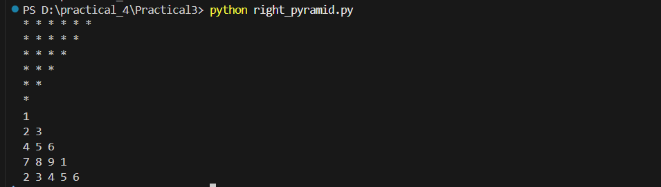

# Practical 3 - Programming Exercises

## Student Details
- **Name:** Vishwa Surati  
- **Enrolment No.:** 202504104610003
- **Course:** MCA  
- **Semester:** 2  

---

## 📌 Objective
The objectives of this practical are:  
1. Learn to create and display **patterns** using Python loops.  
2. Generate a **right half pyramid** and a **full (reverse) pyramid** pattern.  
3. Find **even numbers between 1 to 100** and calculate minimum, maximum, and sum.  
4. Practice organizing files in **folders** and pushing code & outputs to **GitHub**.  

---

## 📂 Folder Structure
practical4/
│
├── Practical3/ # Python program files
│ ├── right_half_pyramid.py
│ ├── full_pyramid.py
│ └── even_numbers.py
│
└── screenshots/ # Output screenshots
├── right_half_pyramid_output.png
├── full_pyramid_output.png
└── even_numbers_output.png

---

## 🖼️ Screenshots

### 1. Right Half Pyramid Output


### 2. Full Pyramid Output


### 3. Even Numbers Output


---

## 📝 Instructions to Run
1. Open **Practical3** folder.  
2. Run Python files using:
```bash
python right_half_pyramid.py
python full_pyramid.py
python even_numbers.py


